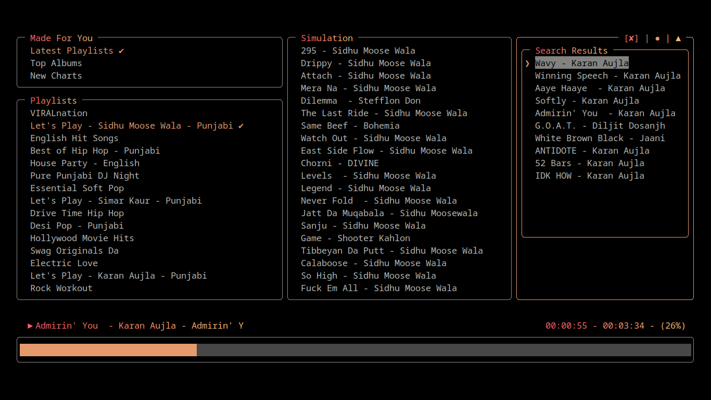

<p align="center"></p>

<p align="center">
  
  
  
</p>

<a href='https://asciinema.org/a/696484'>
	<p align="center">
  	
	</p>
</a>

<h2>🧐 Features</h2>

Here're some of the project's best features:

- Music Discovery: Browse and search for millions of songs and albums.
- Playlists: Create edit your very own custom playlists.
- High-Quality Audio: Enjoy music in high-quality audio formats.
- User Profiles: Manage your account like a pro.
- Artist Profiles: Explore artist bios discographies and more.
- Many more: Queue, lyrics, Downloads and what not.
- TUI Version Available.

<h2>🛠️ Installation Steps:</h2>

### Web:-

#### Build from source:-

<p>1. Clone the repository</p>

```bash
git clone https://github.com/samay15jan/sparklines && cd sparklines
```

<p>2. Install dependencies:</p>

```bash
npm install
```

<p>3. Run and Enjoy the project</p>

```bash
npm run dev
```

<p>4. Navigate to http://localhost:5173 in your browser to access Sparklines.</p>
  
### TUI:-

#### Npm package:-
[](https://www.npmjs.com/package/sparklines-tui)

```bash
npm install sparklines-tui -g
```

#### Build from Source :-
<p>1. Clone the repository:</p>

```bash
git clone https://github.com/samay15jan/sparklines
```

<p>2. Install dependencies:</p>

```bash
cd TUI && npm install
```

<p>3. Link the package globally:</p>

```bash
sudo npm install -g sparklines-tui && sudo npm link
```

<p>4. Start the app in development mode:</p>

```bash
npm run dev 
```

<p>5. find help </p>
```bash
sparklines-tui -h
```

<h2>💻 Built with</h2>

Technologies used in the project:

#### Web
- React.js
- Tailwind CSS
- React Query

#### TUI
- React
- Inkjs and Inkjs/ui

<h2>🛡️ License:</h2>

This project is licensed under the MIT License.

### Contributing

Fork the repo, create a branch, and submit a pull request.
