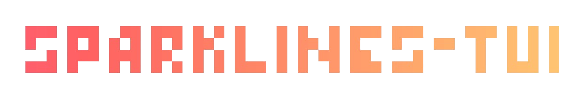
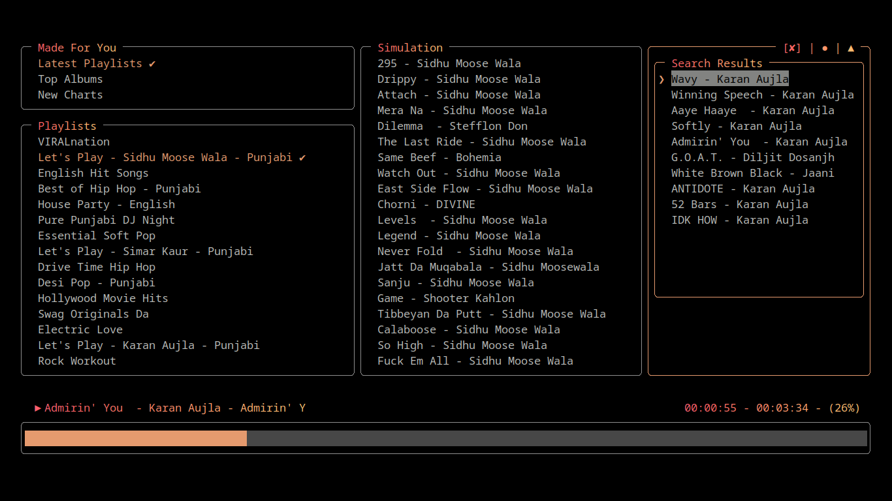
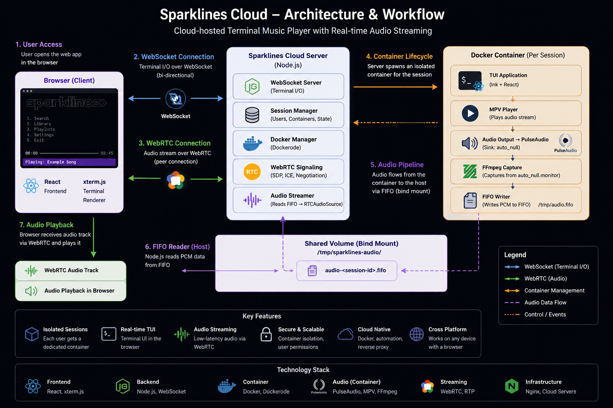

<p align="center">

<br>
**Terminal Music Player • Browser Streaming • Containerized Sessions**
<br>
<a href="https://www.npmjs.com/package/sparklines-tui">
  
</a>
<a href="https://www.npmjs.com/package/sparklines-tui">
  
</a>


<br>


<br><br>
<a href="https://medium.com/p/95958c5d4a7c">
  
</a>
<a href="https://dev.to/samay15jan/how-i-built-a-tui-without-leaving-the-terminal-1g0e">
  
</a>
<a href="https://www.npmjs.com/package/sparklines-tui">
  
</a>
</p>

---

<p align="center">
  
</p>

---

## Overview

**Sparklines TUI** is a terminal-based music streaming client built with **React Ink** that brings a modern music experience directly into the command line.

The project allows users to:

* Search songs, albums, and artists
* Stream music directly from the terminal
* Manage playback and queues
* Authenticate against the Sparklines backend
* Navigate through a rich text-based interface

Originally created as an experiment to answer:

> Can a complete music streaming experience exist entirely inside a terminal?

Over time, the project evolved into a fully interactive terminal application and later expanded into **Sparklines TUI Cloud**, an experimental browser-accessible platform capable of running isolated TUI sessions inside Docker containers.

Today, this repository contains two major components:

### Sparklines TUI

The original terminal music player.

* Music streaming
* Search songs, albums, and artists
* Authentication
* Queue management
* Keyboard shortcuts
* React Ink UI
* MPV audio playback

### Sparklines TUI Cloud

A browser-accessible platform built around Sparklines TUI.

* Docker-based session isolation
* Browser terminal rendering
* WebSocket terminal transport
* Dockerode orchestration
* Experimental WebRTC audio delivery
* FIFO-based audio transport

---

## Architecture

<p align="center">
  
</p>

### System Flows

| Session Flow   | Audio Flow |
| -------------- | ---------- |
| Browser        | MPV        |
| ↓ WebSocket    | ↓          |
| Node.js Server | PulseAudio |
| ↓ Dockerode    | ↓          |
| Container      | FFmpeg     |
| ↓              | ↓          |
| Sparklines TUI | FIFO Pipe  |
|                | ↓          |
|                | Node.js    |
|                | ↓          |
|                | WebRTC     |
|                | ↓          |
|                | Browser    |

---

## Features

### Sparklines TUI

* Search songs, artists and albums
* Stream music directly from terminal
* Authentication support
* Queue management
* Playback controls
* Keyboard shortcuts
* Continuous playback
* Rich React Ink interface

### Sparklines TUI Cloud

* Containerized user sessions
* Browser-accessible terminals
* Docker-based isolation
* WebSocket terminal streaming
* Session lifecycle management
* Dockerode orchestration
* Experimental browser audio pipeline

### Audio Pipeline

* MPV playback
* PulseAudio capture
* FFmpeg processing
* FIFO transport
* WebRTC delivery

---

## Screenshots

<p align="center">
  
</p>

---

## Installation

### NPM

```bash
npm install -g sparklines-tui
```

### Verify

```bash
sparklines-tui --help
```

---

## Usage

### Start Application

```bash
sparklines-tui
```

### Available Commands

```bash
sparklines-tui --login
sparklines-tui --register
sparklines-tui --help
```

---

## Development

### Clone Repository

```bash
git clone https://github.com/samay15jan/sparklines.git
cd sparklines
```

### Install Dependencies

```bash
npm install
```

### Start Development Environment

```bash
npm run dev
```

---

## Docker

### Build

```bash
docker compose build
```

### Run

```bash
docker compose up
```

### Stop

```bash
docker compose down
```

### Image

```bash
sparklines-tui:latest
```

---

## Sparklines TUI Cloud

The cloud platform launches isolated TUI sessions inside Docker containers and streams them directly to browsers.

### Technology Stack

* Node.js
* Docker
* Dockerode
* WebSocket
* WebRTC
* PulseAudio
* FFmpeg
* MPV
* xterm.js

### Browser Components

* xterm.js Terminal
* WebSocket Terminal Transport
* WebRTC Audio Transport

---

## Current Status

### Stable

* Native TUI Experience
* Browser Terminal Rendering
* Dockerized Sessions
* Session Management
* WebSocket Streaming
* Audio Capture Pipeline
* FIFO Audio Transport
* Docker Compose Support

### Experimental

* Browser Audio Playback

### Verified Audio Path

```text
MPV
↓
PulseAudio
↓
FFmpeg
↓
FIFO
↓
Host
↓
Node.js
↓
WebRTC
```

Audio successfully reaches the host machine and WebRTC establishes a connection with the browser.

Final browser-side audio playback remains under investigation.

---

## Project Timeline

### v1 — Sparklines TUI

Terminal music streaming client built using React Ink.

### v2 — Sparklines TUI Cloud

Containerized browser-accessible terminal sessions powered by Docker, WebSockets, and WebRTC.

### Future

* Shared listening sessions
* Playlist synchronization
* Browser audio completion

---

## Blog Posts

### How My Terminal Music Player Accidentally Became a Cloud Platform 

https://medium.com/@samay15jan/how-my-terminal-music-player-accidentally-became-a-cloud-platform-d1aa46d0cb86

### How I Built a TUI Without Leaving the Terminal

https://medium.com/@samay15jan/how-i-built-a-tui-without-leaving-the-terminal-95958c5d4a7c

---

## Contributing

Contributions are welcome.

### Setup

```bash
git clone https://github.com/samay15jan/sparklines.git

npm install

npm run dev
```

### Workflow

1. Fork the repository
2. Create a feature branch
3. Commit changes
4. Open a Pull Request

---

## Demo
[](https://asciinema.org/a/696484)

---

## Changelog 

## License

MIT License

---

## Author

**Samay Kumar**

* GitHub: https://github.com/samay15jan
* Website: https://samay15jan.com

---

> Building unusual systems is often more interesting than building useful ones.
