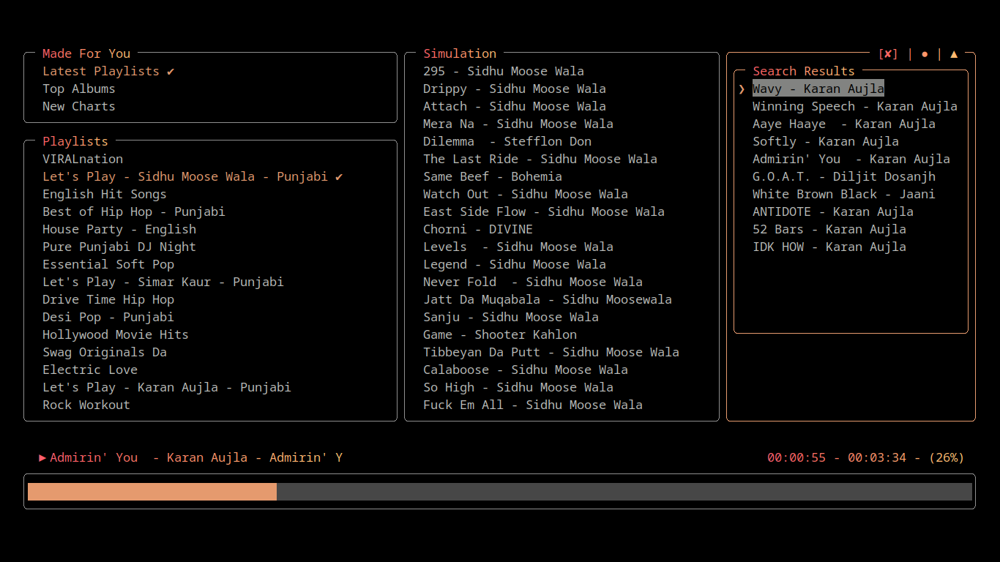

# Sparklines TUI

#### A text-based user interface for Sparklines built with Ink.




## Features

- Control music directly from the terminal.
- Login/Register functionality.
- API key-based interaction with Sparklines Backend.
- Continuous playback and clean playback bar.
- Custom shortcuts & help menu.
- Search songs, albums, and artists.
- Music language selector.
- Recommendations & infinite play (work in progress). [TODO]
- Loop, shuffle, queue, and lyrics support (coming soon). [TODO]

## PreRequisites

Before using Sparklines TUI, make sure you have the following installed:

- [cUrl](https://curl.se/): For making network requests.
- [Node.js](https://nodejs.org/en): Required for running the application.
- [MPV](https://mpv.io/): For handling audio playback.

## Installation

#### You can install this package globally with npm:

```bash
	npm install -g sparklines-tui
```

#### Build from Source:-
1. Clone the repository:

```bash
	$ git clone https://github.com/samay15jan/sparklines
```

2. Install dependencies:

```bash
	$ cd TUI && npm install
```

3. Link the package globally:

```bash
	$ npm link
```

4. Start the app in development mode:

```bash
	$ npm run dev
```

## Usage

#### Display the help menu:

```bash
$ sparklines-tui -h

  Usage
    $ sparklines-tui

  Options
    --login, -l       Log in to the application
    --register, -r    Register a new account
    --help, -h        Show this help message

  Examples
    $ sparklines-tui --login
    $ sparklines-tui --register
    $ sparklines-tui --help

  For more information, refer github repository at https://github.com/samay15jan/sparklines

```

### Contributing

Fork the repo, create a branch, and submit a pull request.

### License

Released under the MIT License.


### DEMO

[](https://asciinema.org/a/696484)
